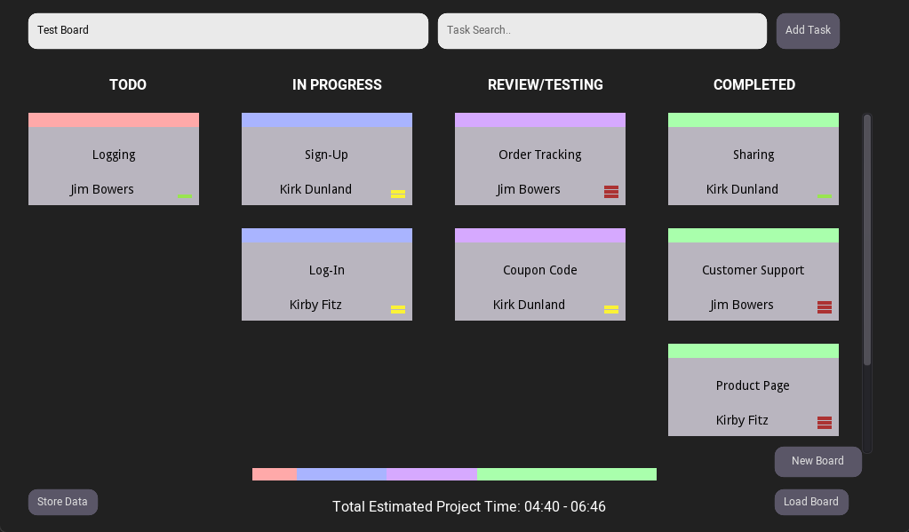
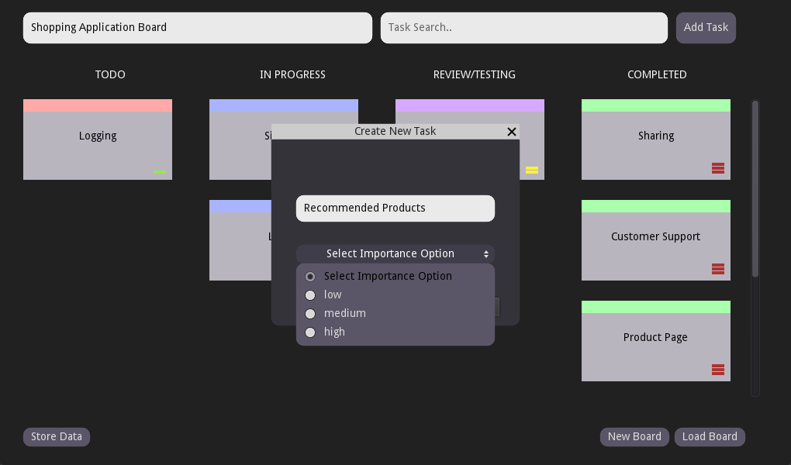
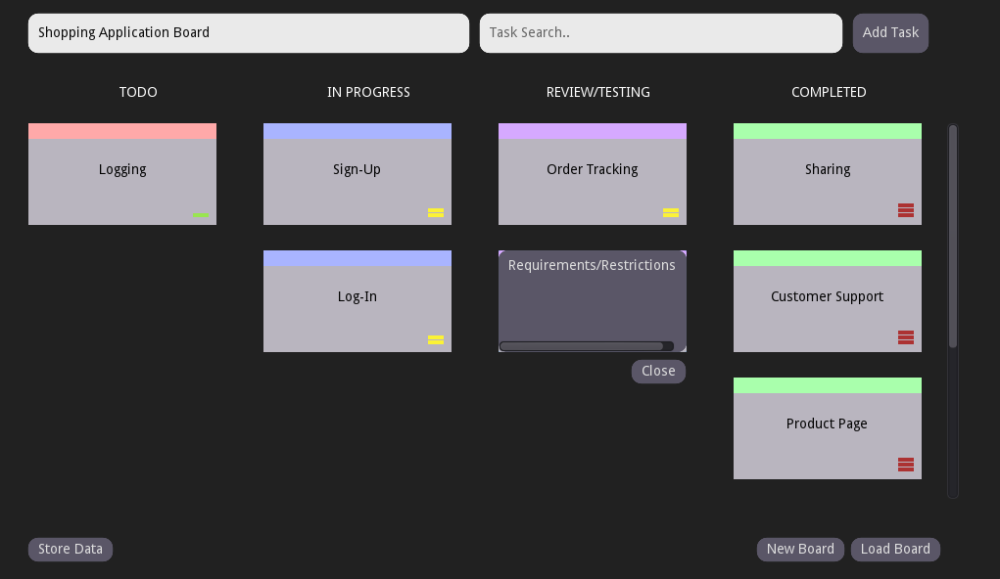
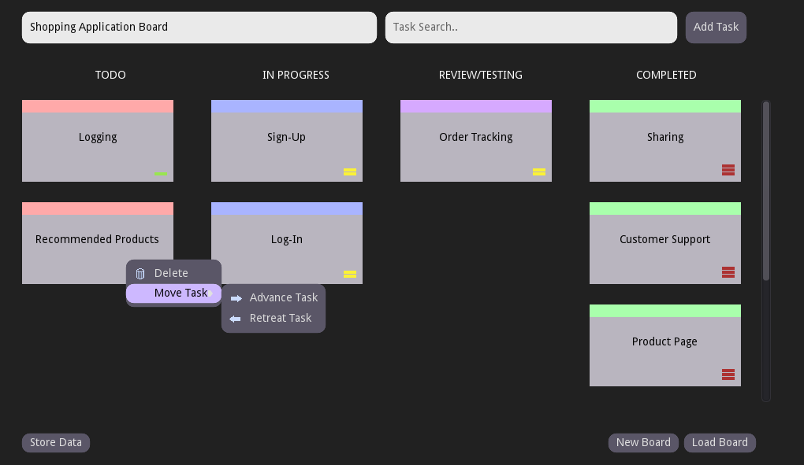
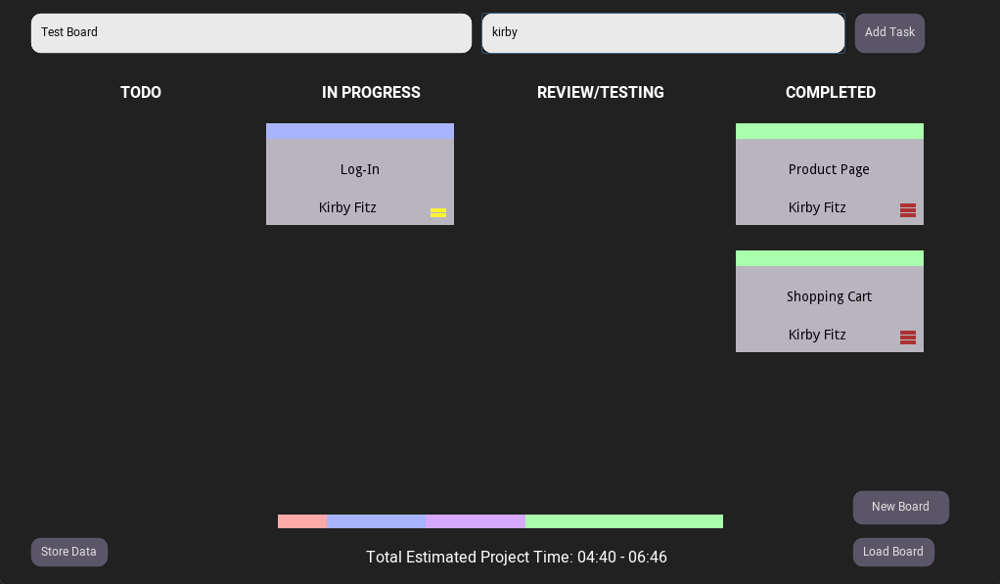

# GDScript AGILE Board

 
 

 ## What is AGILE development?
 Agile is an iterative approach to project management and software development that helps teams deliver value to their customers faster and with fewer headaches. Instead of betting everything on a "big bang" launch, an agile team delivers work in small, but consumable, increments. This board was intended to be used by a solo developer rather than a team but can easily have team member assignment added in.

 ## Board Features

- **Add** tasks
- **Delete** tasks
- Give tasks a **level of importance**
- **Move tasks** around on the board to represent it's status
- Create **new boards**
- **Name**, **Save** and **Load** boards
- Leave important **notes** for each task

Add new tasks to the board and give it an importance level.

Left click any task to get a popup box where you can put any notes or client requirements/restrictions related to said task. Right click the same task to hide this menu.

Right click on any task to be able to delete a task or move its position on the board.

Search or filter through your board for specific tasks.

## Known Issues
None.